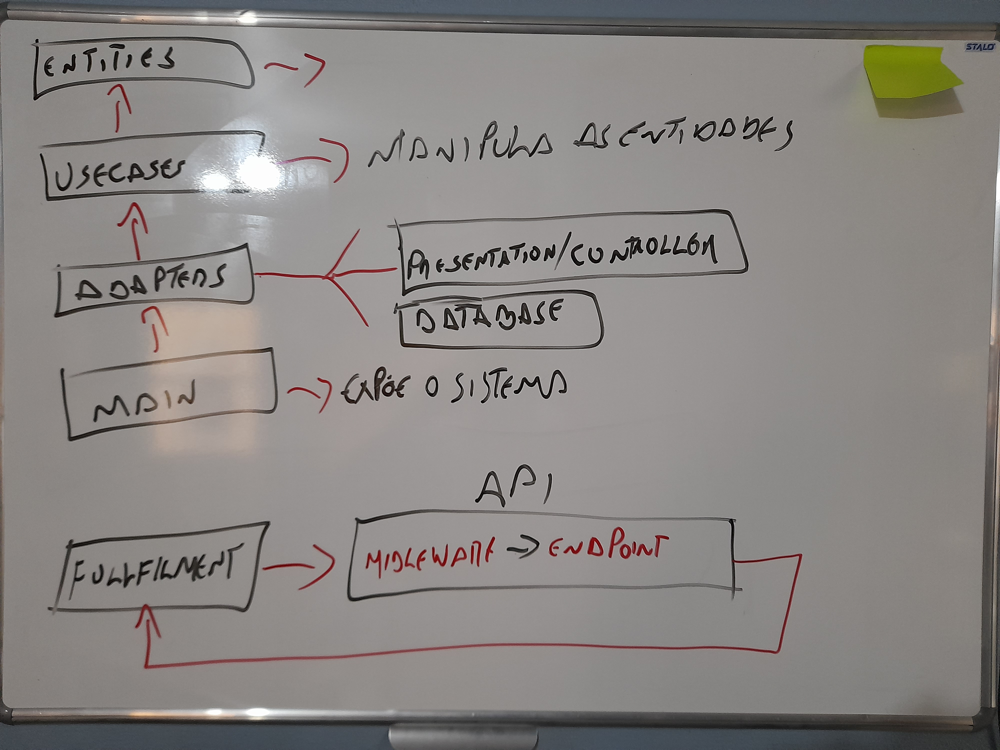

# **POC - Dr. Coronga**

>POC chatbot COVID-19
Telegram: @poc_covid_19_bot
---

> ## Instalação

- clonar o o repositório
  - git clone git@github.com:LuizPiresS/poc-covid-19.git
  - npm i
  - npm run start:production ou npm run start:dev

> ### Arquiteturas/designs utilizados

- [Clean Architecture](https://blog.cleancoder.com/uncle-bob/2012/08/13/the-clean-architecture.html)
- 
- TDD

> ### Bibliotecas e ferramentas utilizadas

- [Express](https://expressjs.com/)
- [Jest](https://jestjs.io/)
- [Eslint](https://typicode.github.io/husky/#/)
- [Standard code Style](https://standardjs.com/)
- [Husky](https://typicode.github.io/husky/#/)
- [Lint-staged](https://github.com/okonet/lint-staged)
- [Github Actions](https://github.com/features/actions)
- [Conventional Commits](https://www.conventionalcommits.org/pt-br/v1.0.0/)

> ### Features
